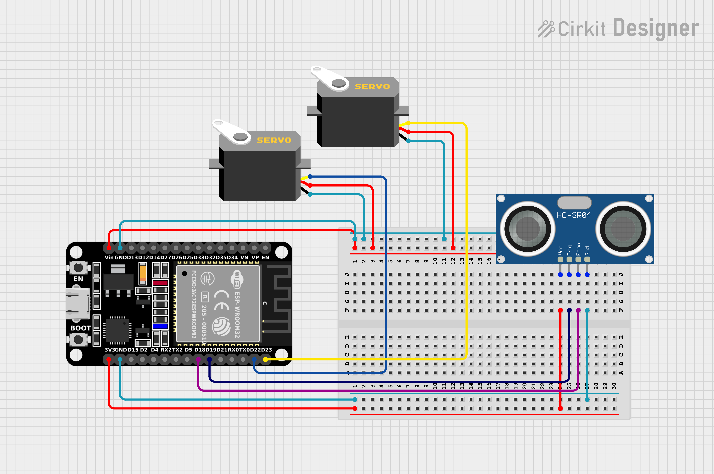
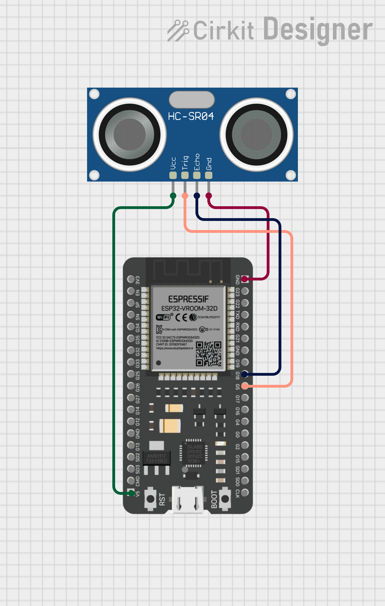
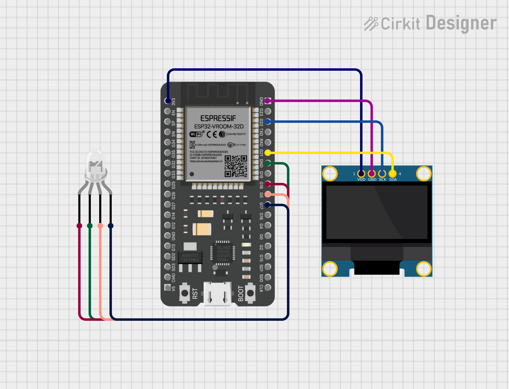
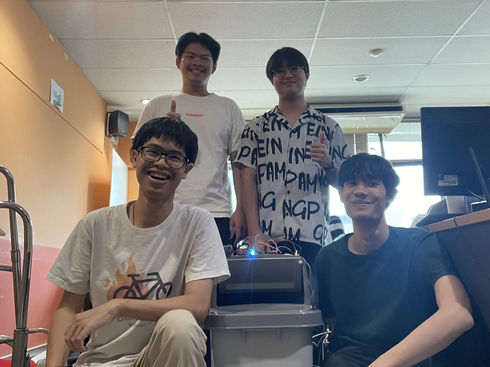

# Smashtrash

# Feature

## 1. Trash Opener (ระบบเปิดถังขยะ)

อุปกรณ์ที่ใช้

1. NodeMCU ESP32 1 Unit.
2. Servo Motor 2 Units.
3. Ultrasonic Sensor 1 Unit.

ไลบราลี่

1. ESP32-Servo
2. ESP-NOW

ระบบการทำงาน

1. Ultrasonic Sensor ตรวจระยะทางของวัตถุที่ผ่าน หากน้อยกว่า 20 cm ให้เปิดถังขยะ.
2. ถังขยะจะเปิดเป็นระยะเวลา 5 วินาทีนับจากเมื่อวัตถถุไม่ผ่านหน้า Ultrasonic Sensor แล้ว.
3. ถ้าวัตถุผ่านหน้า Ultrasonic Sensor อีกครั้ง ระบบจะจับเวลาในการเปิดใหม่.
4. มีการคุยกับ ESP32 ตัวอื่นผ่าน ESP-NOW สำหรับรับค่าเปอร์เซ็นต์ของถังขยะ.
5. ถ้าปริมาณขยะมากกว่า 70% ถังขยะจะไม่สามารถเปิดได้.

### Schematic

## 2. TrashMeasure (ระบบวัดปริมาณขยะในถัง)

อุปกรณ์ที่ใช้

1. NodeMCU ESP32 1 Unit.
2. Ultrasonic Sensor 1 Unit.

ไลบรารี่

1. ESP-NOW

ระบบการทำงาน

1. ตัว Ultrasonic จะติดอยู่ใต้ฝาถังขยะ โดยจะวัดระยะทางจากฝาถังไปยังตัวขยะ (distance)
2. จากนั้นนำค่า distance และจะมีค่าที่เป็นความสูงของถังขยะ (max_distance) มา map เป็น % ของปริมาณขยะในถัง
3. ส่งค่า % ปริมาณขยะในถัง ไปยังฟีเจอร์อื่นๆ เพื่อนำไปแสดงผลและการเปิดฝาถังขยะ โดยใช้ ESP-NOW ในการส่งข้อมูล

### Schematic

## 3. Trash Output (ระบบแสดงผลของถังขยะ)

อุปกรณ์ที่ใช้

1. NodeMCU ESP32 1 Unit.
2. LED:Four Pin 1 Units.
3. OLED 128x64 I2C Monochrome Display VDD-GND 1 Unit.

ไลบราลี่

1. Adafruit_GFX
2. Adafruit_SSD1306
3. ESP-NOW

ระบบการทำงาน

1. ใช้ ESP-NOW สำหรับรับค่าเปอร์เซ็นต์ของขยะในถังขยะ.
2. รับค่ามาแล้วคำนวณเป็นสีของ LED (<50% -> Green, <75% -> Blue, else -> Red)
3. คำนวณข้อมูลที่ต้องใช่ในการแสดงผลบนจอ OLED.
4. แสดง Output สีของ LED และข้อความบนจอ OLED.

### Schematic

## 4. Trash Bin Lock (ระบบล็อคถังขยะ)

อุปกรณ์ที่ใช้

1. NodeMCU ESP32 1 Unit.
2. 180 degree servo 4 Units.
3. OLED 128x64 I2C Monochrome Display VDD-GND 1 Unit.
4. 4x4 Numpad 1 Units.

ไลบราลี่

1. Adafruit_GFX
2. Adafruit_SSD1306
3. Keypad
4. ESP32-Servo

ระบบการทำงาน

1. ในขณะที่ถังขยะทำงานปกติ ถังขยะจะล็อกฝาไม่ให้ยกออกได้ ป้องกันการที่ขยะเต็มแล้วมีคนใส่เพิ่ม
2. กรณีต้องการยกขยะด้านในออก สามารถใส่รหัสที่หลังฝาได้
3. servo จะทำการยกเอ็นที่เกี่ยวกับตัวเกี่ยวด้านในขึ้น ทำให้ฝายกได้
4. หลังจากยกขยะออกแล้ว ทำการล็อกด้วยการกด ####
5. โดยรหัสที่กดและสถานะล็อค/ปลดล็อคจะมีแสดงที่จอด้านหลัง

### Schematic

## Members

1. นายจิรัฏฐ์ มีวาสนา 6410500181
2. นายณัฏฐ์ ปรัชญกุล 6410500238
3. นายจตุพร บัดแก้ว 6410503997
4. นายณพวิทย์ ศุกลปักษ์ 6410504098

