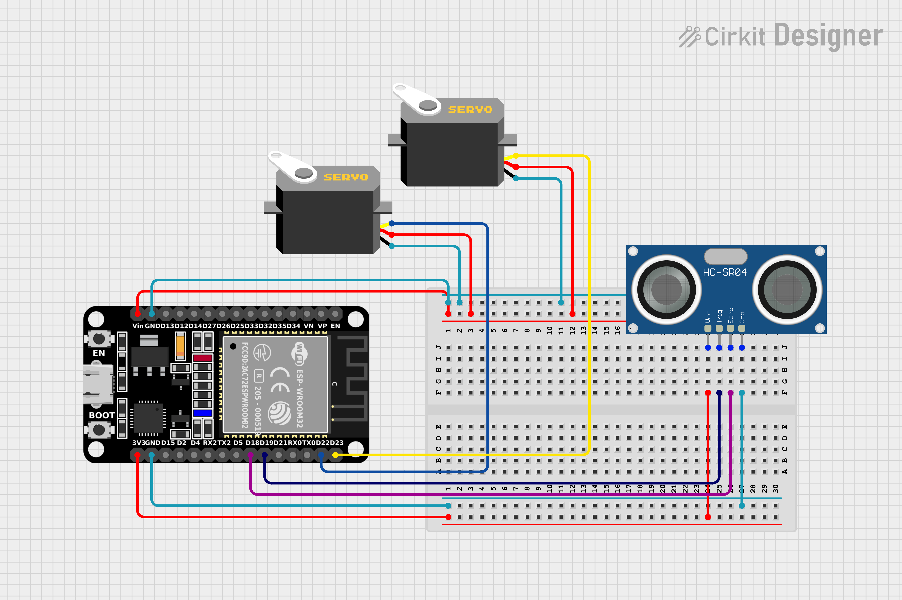

# Smashtrash

# Feature

## 1. Trash Opener (ระบบเปิดถังขยะ)
อุปกรณ์ที่ใช้
1. NodeMCU ESP32 1 Unit.
2. Servo Motor 2 Units.
3. Ultrasonic Sensor 1 Unit.

ไลบราลี่
1. ESP32-Servo
2. ESP-NOW

ระบบการทำงาน
1. Ultrasonic Sensor ตรวจระยะทางของวัตถุที่ผ่าน หากน้อยกว่า 20 cm ให้เปิดถังขยะ.
2. ถังขยะจะเปิดเป็นระยะเวลา 5 วินาทีนับจากเมื่อวัตถถุไม่ผ่านหน้า Ultrasonic Sensor แล้ว.
3. ถ้าวัตถุผ่านหน้า Ultrasonic Sensor อีกครั้ง ระบบจะจับเวลาในการเปิดใหม่.
4. มีการคุยกับ ESP32 ตัวอื่นผ่าน ESP-NOW สำหรับรับค่าเปอร์เซ็นต์ของถังขยะ.
5. ถ้าปริมาณขยะมากกว่า 70% ถังขยะจะไม่สามารถเปิดได้.

### Schematic

## Members
1. นายณัฏฐ์ ปรัชญกุล 6410500238
2. xxx xxx 6410500xxx
3. xxx xxx 6410500xxx
4. xxx xxx 6410500xxx
5. xxx xxx 6410500xxx

